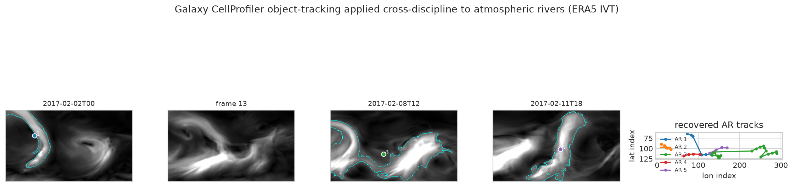

# fiesta-galaxy-cellprofiler-eo

[](https://github.com/annefou/fiesta-galaxy-cellprofiler-eo/actions/workflows/ci.yml)
[](https://annefou.github.io/fiesta-galaxy-cellprofiler-eo/)
[](https://github.com/annefou/fiesta-galaxy-cellprofiler-eo/pkgs/container/fiesta-galaxy-cellprofiler-eo)
[](https://opensource.org/licenses/MIT)
[](docs/fair4rs-checklist.md)
[](https://forrt.org/)
[](nanopubs/PUBLISHED.md)
[](ro-crate-metadata.json)

> **A bioimaging object tracker, applied cross-discipline to Earth-system science.**
> CellProfiler's `TrackObjects` — built to follow **dividing nuclei** in fluorescence time-lapse microscopy — run **unchanged** through a Galaxy workflow to detect and track **atmospheric rivers** across an ERA5 reanalysis time series. A bright atmospheric-river filament in the IVT field is the climate-science mirror of a bright nucleus on a dark background; a river that intensifies, drifts and splits is the mirror of a dividing nucleus.

Part of **OSCARS-FIESTA** (cross-image analysis *with Galaxy*) — a companion to [fiesta-galaxy-bioimageio-eo](https://github.com/annefou/fiesta-galaxy-bioimageio-eo) and [fiesta-galaxy-sourceextractor-eo](https://github.com/annefou/fiesta-galaxy-sourceextractor-eo). This is **not** a replication of a paper: it reuses the Galaxy Training Network tutorial *"Object tracking using CellProfiler"* ([`gxy.io/GTN:T00516`](https://gxy.io/GTN:T00516)) and the CellProfiler software ([McQuin et al. 2018](https://doi.org/10.1371/journal.pbio.2005970)), applying the same tracking pipeline to Earth-system data with the established atmospheric-river detection criteria of [Guan & Waliser (2015)](https://doi.org/10.1002/2015JD024257).

## Result

Run on the **early-February 2017** North-Pacific atmospheric-river sequence (ERA5 IVT, 6-hourly), the CellProfiler tracking pipeline — designed for dividing nuclei — detects and tracks atmospheric rivers **unchanged**: across the 10-day window it recovered **5 distinct AR tracks**, following one persistent river for **22 consecutive 6-hourly steps (5.5 days)**, up to **9,559 km** long, with peak IVT of **1,625 kg m⁻¹ s⁻¹**. Detection applies the literature criteria (IVT > 250 kg m⁻¹ s⁻¹, length > 2000 km, length/width > 2, poleward flux > 50 kg m⁻¹ s⁻¹); tracking is frame-to-frame overlap — exactly `IdentifyPrimaryObjects` + `MeasureObjectSizeShape` + `TrackObjects`.



## Two ways to run — Galaxy first

- **Galaxy (showcased):** `notebooks/03_analysis.py` runs the IVT frames through [`workflow/main_workflow.ga`](workflow/main_workflow.ga) — the CellProfiler module chain (Starting Modules → ColorToGray → IdentifyPrimaryObjects → MeasureObject* → TrackObjects[Overlap] → OverlayOutlines → Tile → SaveImages → ExportToSpreadsheet) — on **usegalaxy.eu** (Galaxy Europe) via BioBlend. **This path needs a usegalaxy.eu API key** at `~/.galaxy_eu_key` (free account → *User → Preferences → Manage API Key*). The workflow imports and resolves all 13 tools on usegalaxy.eu, and the CellProfiler module chain + all 40 IVT frames run on a real published history; making the final monolithic runner green needs a one-time GUI finalization — see **[`docs/galaxy-finalize.md`](docs/galaxy-finalize.md)** (standard Galaxy practice for CellProfiler).
- **Local (default / CI):** the *same algorithm* offline (scikit-image + scipy with the full Guan-Waliser AR criteria) — **no key needed**, so CI and the Jupyter Book build hermetically.

## Quick start

```bash
git clone https://github.com/annefou/fiesta-galaxy-cellprofiler-eo.git
cd fiesta-galaxy-cellprofiler-eo
pixi install
pixi run snakemake --cores 1
```

Or with Docker:

```bash
docker run --rm ghcr.io/annefou/fiesta-galaxy-cellprofiler-eo:latest
```

The Jupyter Book version is at <https://annefou.github.io/fiesta-galaxy-cellprofiler-eo/>.

### Data — fully reproducible, no credentials

`notebooks/01_data_download.py` pulls **ERA5 IVT** (vertically-integrated water-vapour transport) from **ARCO-ERA5**, the analysis-ready ERA5 mirror on Google Cloud — **public and anonymous**. The exact store, variables, region (North Pacific), window and 6-hourly cadence are pinned in the notebook, and every step (download → IVT computation → detection → tracking → figures) is recorded in the Jupyter Book. Override the region/window with `FIESTA_LAT_*`, `FIESTA_LON_*`, `FIESTA_START`, `FIESTA_END` to track AR events anywhere.

## Repository structure

```
.
├── CLAUDE.md / AGENTS.md       # operating manual for AI assistants
├── DOMAIN.md                   # domain flavour (biodiversity + earth observation)
├── README.md                   # this file
├── LICENSE / CITATION.cff / codemeta.json / ro-crate-metadata.json
├── pixi.toml + pixi.lock       # pinned dependencies (single source of truth)
├── Dockerfile / Snakefile      # container + pipeline orchestration
├── myst.yml + index.md         # Jupyter Book
├── workflow/main_workflow.ga   # the Galaxy CellProfiler tracking workflow
├── notebooks/                  # jupytext .py pipeline (01 download → 04 figures)
├── scripts/cellprofiler_tracking.py  # Galaxy (BioBlend) + local same-algorithm driver
├── nanopubs/                   # FORRT chain drafts + published-URI registry
├── docs/  figures/  .github/workflows/  .claude/
```

## Built from a template

This repository was created from [`ScienceLiveHub/forrt-replication-template`](https://github.com/ScienceLiveHub/forrt-replication-template), part of the [Science Live platform](https://platform.sciencelive4all.org) — FAIR4RS conformance, self-contained data downloads, `pixi` as single source of truth, Jupyter Book deployment, Docker + GHCR + Zenodo archival, RO-Crate packaging, and a six-step FORRT chain workspace.

## FORRT nanopublication chain

The FORRT chain is **drafted** field-by-field in [`nanopubs/drafts/`](nanopubs/drafts/) (question-rooted: PICO → AIDA → Claim → Study → Outcome → CiTO, plus Research Software) and ready to publish on [platform.sciencelive4all.org](https://platform.sciencelive4all.org); record URIs in [`nanopubs/PUBLISHED.md`](nanopubs/PUBLISHED.md).

## Citation

If you use this work, please cite:

- This software: [`CITATION.cff`](CITATION.cff) → concept DOI minted on first release.
- The reused software: CellProfiler — [McQuin et al. 2018](https://doi.org/10.1371/journal.pbio.2005970), [Carpenter et al. 2006](https://doi.org/10.1186/gb-2006-7-10-r100).
- The reused method: GTN tutorial *Object tracking using CellProfiler* — [`gxy.io/GTN:T00516`](https://gxy.io/GTN:T00516).
- AR detection criteria: [Guan & Waliser 2015](https://doi.org/10.1002/2015JD024257); ARTMIP [Shields et al. 2018](https://doi.org/10.5194/gmd-11-2455-2018).
- Data: ERA5 (Hersbach et al. 2020) via [ARCO-ERA5](https://cloud.google.com/storage/docs/public-datasets/era5).

## Acknowledgements

Built from [`ScienceLiveHub/forrt-replication-template`](https://github.com/ScienceLiveHub/forrt-replication-template). Contributions (especially new domain flavours under [`docs/domain-flavours/`](docs/domain-flavours/)) are welcome.
