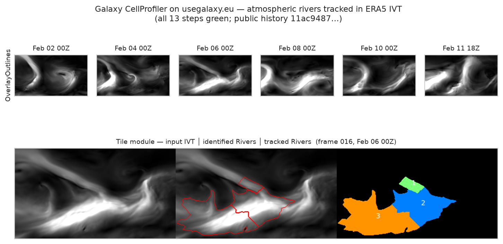

# fiesta-galaxy-cellprofiler-eo

> **Galaxy bioimaging tools, applied cross-discipline to Earth-system science.**
>
> Part of OSCARS-FIESTA. Reuses the GTN tutorial [`gxy.io/GTN:T00516`](https://gxy.io/GTN:T00516) and CellProfiler ([McQuin et al. 2018](https://doi.org/10.1371/journal.pbio.2005970)).

CellProfiler's `TrackObjects` module — built to follow **dividing nuclei** in fluorescence time-lapse microscopy — is run **unchanged** through a Galaxy workflow on **usegalaxy.eu** (Galaxy Europe) to detect and track **atmospheric rivers** across an ERA5 IVT time series (the early-February 2017 North-Pacific sequence). A bright atmospheric-river filament in the IVT field is the climate mirror of a bright nucleus on a dark background, and a river that intensifies, drifts and splits is the mirror of a dividing nucleus. This repository produces:

- A reproducible pipeline (Snakefile + notebooks), runnable on Galaxy or via a same-algorithm local fallback — every step (download, IVT computation, detection, tracking, figures) recorded here.
- A Science Live nanopublication chain documenting the claim, method, and outcome with provenance.
- A Zenodo-archived release (source + container image) with a citable DOI.

## Quick start

```bash
git clone https://github.com/annefou/fiesta-galaxy-cellprofiler-eo.git
cd fiesta-galaxy-cellprofiler-eo
pixi install
pixi run snakemake --cores 1
```

## Two ways to run

- **Galaxy (showcased):** runs `workflow/main_workflow.ga` on **usegalaxy.eu** via BioBlend. **Requires a usegalaxy.eu API key** at `~/.galaxy_eu_key`. The workflow — rebuilt from the GTN tutorial's own workflow and retargeted to ERA5 IVT frames — runs **end-to-end with all 13 steps green** (incl. the final *Run CellProfiler pipeline* runner), producing `TrackObjects` measurements + tracked PNGs on a [public history](https://usegalaxy.eu/histories/view?id=11ac94870d0bb33ad591597e3e548295).
- **Local (default / CI):** the *same algorithm* offline (scikit-image Otsu/threshold + Guan-Waliser AR criteria + overlap tracking) — no key needed.

## The Galaxy run



The CellProfiler module chain runs end-to-end on **usegalaxy.eu** (all 13 steps green, including the final *Run CellProfiler pipeline* runner) and produces `TrackObjects` measurements and the images above — see the public history [`11ac9487…`](https://usegalaxy.eu/histories/view?id=11ac94870d0bb33ad591597e3e548295). The Galaxy run uses the GTN tutorial's default CellProfiler parameters and demonstrates the bioimaging tracking *method* executes on Earth-system data; the quantitative atmospheric-river characterisation (Guan & Waliser criteria) is the byte-comparable local same-algorithm path shown in the notebooks below.

## Method

Atmospheric rivers are detected per timestep with the established criteria (Guan & Waliser 2015; ARTMIP): IVT > 250 kg m⁻¹ s⁻¹, length > 2000 km, length/width > 2, poleward flux > 50 kg m⁻¹ s⁻¹ — i.e. `IdentifyPrimaryObjects` + `MeasureObjectSizeShape` + a geometry filter — then linked across consecutive 6-hourly steps by overlap (`TrackObjects`).

## Nanopublication chain

The FORRT chain is drafted in [`nanopubs/drafts/`](nanopubs/drafts/); publish on the Science Live platform and record URIs in [`nanopubs/PUBLISHED.md`](nanopubs/PUBLISHED.md).
